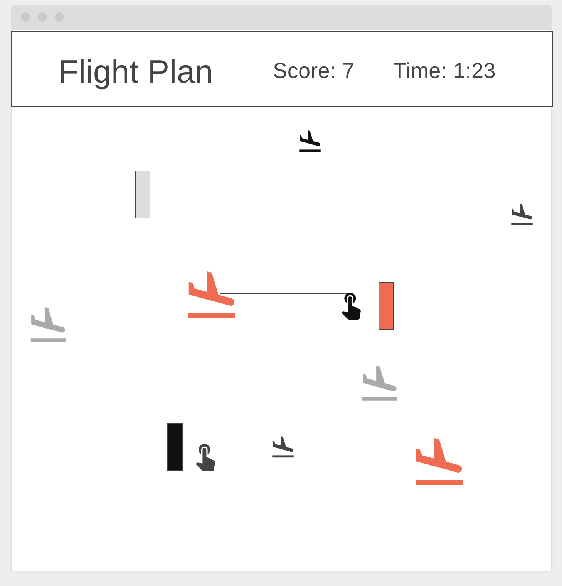

# **Bubble Bop**

### **Background:**

Bubble Bop is a marathon game where the objective is to land as many planes to their respective terminals. There are three colored planes (red, blue, yellow) and three corresponding colored terminals. 
The planes will spawn from the top left corner at varying directions, but with their respective speeds. Terminals, on the other hand will appear on the right side of the screen as fixed locations.
The player can direct the plane by clicking on the screen, which creates a path. Players can manipulate the planes' trajectories by making it bounce off the path into the terminals. As the game progresses, planes will spawn at faster rates. Once a plane crashes into another plane, the game is over.
____________________________________________________________________________

### **Functionality & MVPs:**

- Player Controls: 
    - Click on the screen and create paths (up to 4 paths at a time)
    - Paths automatically disappear after a set amount of time

- Game Objects:
    - Ball spawns randomly and in faster rates as time progresses
    - Follows ball path until the end, where it continues move in a linear fashion
    - Turns back 180˚ when ball reaches the edge of the screen
    - Prompt GameOver screen when two balls crashes into each other
    - Red balls: big size and slow speed
    - Blue balls: medium size and medium speed
    - Yellow balls: small size and fast speed

- Terminal
    - Fixed locations with corresponding colors
    - Balls can only score when the reach their respective terminals

- Ball Path
    - Path starts at player click, and ends when player is finished dragging
    - Path’s color corresponds to it’s ball’s color

- NavBar
    - Game Title
    - ScoreBoard

- Settings & Instructions:
    - Sound on/of for music & sound animations
    - GameOver Screen
    - README
____________________________________________________________________________

### **Wireframes:**

____________________________________________________________________________

### **Libraries and APIs:**

- HTML/CSS
- JavaScript
- Canvas
- Webpack

____________________________________________________________________________

### **Implementation Timeline:** 

- 12/30
    - Backbone of the project
    - Initialize all the objects
- 1/3
    - Work on functionalities
- 1/4
    - Work on functionalities
- 1/5
    - Work on functionalities
- 1/6
    - Debug and make it look pretty

____________________________________________________________________________

### **Bonus Features:**

- Aesthetics
- HighScore List at GameOver Screen
- Different maps, where terminals are place in different locations
- Different difficulties, where balls can move slower or faster